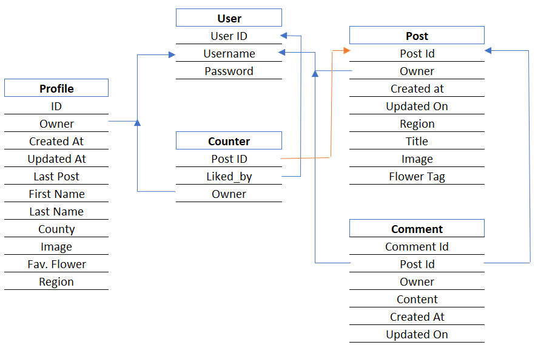
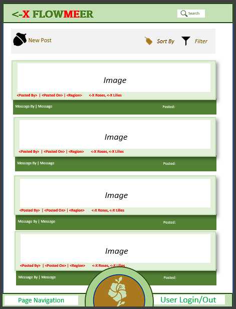
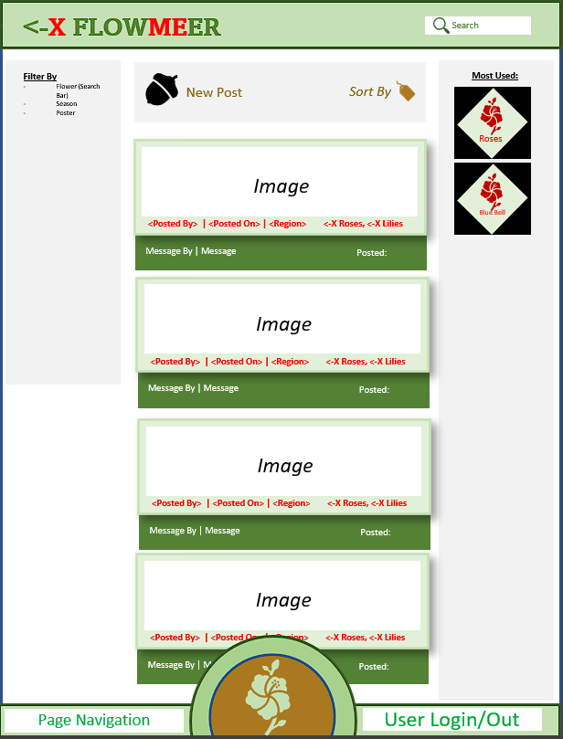
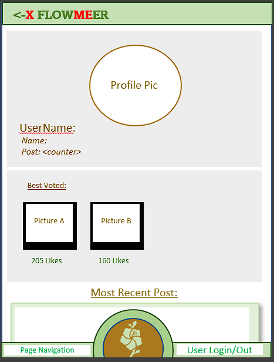
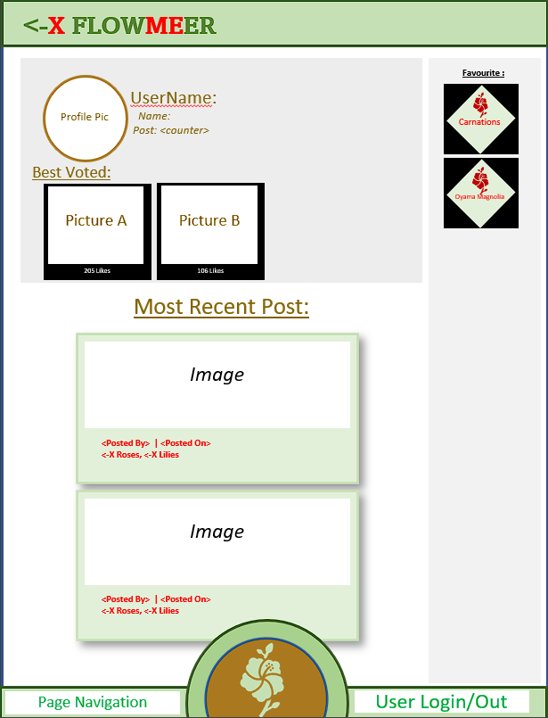
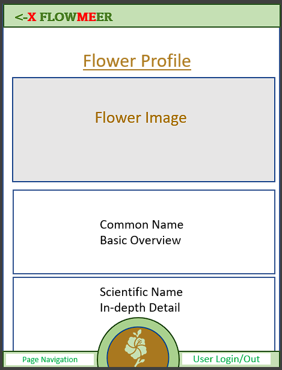
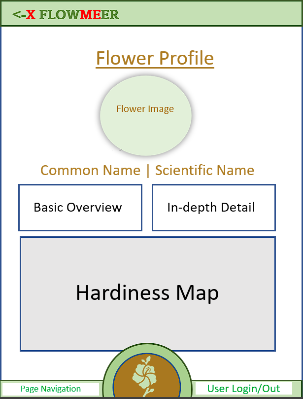

# $${\color{red}FLOW\color{green}ME\color{red}ER}$$
*A website to share botanical experiences with flower lovers alike.*

**Index**
- [Introduction](#Introduction)
- [Research](#Research)
- [Approach](#Approach)
- [Design](#Designing-of-the-Website)
    - [Structure](#structure-of-the-site)
    - [Colors](#color-scheme)
    - [Fonts](#font-selection)
    - [View - Mobile](#mobile-design)
    - [View - Large Screen](#large-design)
- [Expected Uses of Website](#expected-uses-of-website)
- [User Stories](#user-stories)
- [Focus of project](#focus-of-the-project)
- [Progression of Website](#progression-of-website)
    - [Start](#start)
    - [Mid-project](#mid-project)
    - [Final stage](#final-stage)
    - [Future developments](#future-developments)
- [Test & Bugs](#test--bugs)
- [Acknowledgements](#acknowledgements)
- [References](#references)
*******************************

## __Introduction__

For my fith project on my level 5 course of full stack developer, I I have chosen to create a new social feature application witht he name FLOWMEER.

|Link to the live website is here:||
|----|----|
| | https://flowmeer.herokuapp.com |

Link to my readme file and RAW file is here: 

Target use of the website is to allow garden lovers and competition goers and environment to be inspured and learn from each other. Featuring an assembly of reactive apps the main feature will be a feed of post issued by other users.

On first upload, I attempted to connect with my heroku app, but experiencing difficulty with the two step autentication. After making contact with Salesforce, I continued to contribute to my github repository and will revise the deployment when available.
________________________
## __Approach__

Whilst I have no  knowledge of plants, names and gardening, I used a widely used template from social media sites using similar languages. These include: Twitter, Facebook and similar LinkedIn.

Breaking down the layout, this includes three columns - with the central column being the main feed.
Other elements and features vary on the topic. For my primary reserach, I've looked over the following websites:

1. https://perenual.com
1. https://www.rhs.org.uk

To provide information for novice and experienced, I found an API whcih includes a profile of 10,000 plants linking images with profiles fo flowers together to run as a service for all users.
_____________

## __User Stories__ 

To ensure I create the application to suit the users requirements, I have created a list of stories to display my expectations of users:

As a User, I:

1. __Display__
    * Wish to navigate the website with ease simple directions on changing page.
    * View all my content on the same page without having to refresh my page.
    * See all images posed by users and include further details.
    * Filter my feed I wish to view based on my search entries.
    * Add a "Vote" to the image(s) which stand out to me.
1. __Account__
    * Create a new account for myself
    * Log in and out from the website with confirmation of my status.
    * Like images I find interesting which I can find later by a filter.
1. __Create__
    * Add new post/images to the feed.
    * My own profile page, including personal selections and a profile picture.
    * Create comments on post where I wish to leave my feedback

The above entries have been entered onto a KanBan board where I decided the stories with categories of essential/non essential then either group 1, 2 or 3. 

My results come as the following:

|Essential | Non-Essential Group 1 | Group 2 | Group 3 |
|------|--------|------|--------|
| Display of Post | Filter Options | Tagging Flowers | Flower Profile |
| Creating Post | Voting | | | 
| Creating Profile | Adding details on profile page | | | 
| Log In/Out | | | | 

________________________
## __Design__

### Database Model

The website will need to include a relational database to store users post, profile details and link each topic together.

To map out my requirements, I drew a list of fields whilst planning the website and digitalized this on Microsoft Excel. Below image shows the fields drafted at the start of the project:

### Stucture

Previously mentioned, I've opted to replicate the layout similar to the current popular social media sites. After the header and footer, the page is divided into three columns.

The main feature of the page is the central column which include post created by all users of the website. 

Like online retail stores, the website will include a filter option to the left column, where the user can filter by flower, seasons, Account etc. This feature is to move when going in mobile view, instead, this will be on the header of the page, at the top right. 

| Page | Small | Medium & Large |
|--|--|--|
| Main |  | |
| Profile |  |  | 
| Flower Profile |  |  |

### Color Pattern

To match the theme of my chosen topic, I have opted for a mix of light green, dark green, red and brown to be used across my site. All colors can create enough of a contrast to help users read and define outlined topics.

The light green is used as a background color, blending light color applications together but enough to identify where they start and end. 
Brown will be used for text and hover overlays, representing the soil/compost during gardening. This color will contrast enough for the user to see the highlighted icons and read with ease.
Dark Green is used for the logo created and the name to create a contrast. The dark green section of the name - flowmeer highlights the name of "FLOWER" whilst the red places "ME" within the flower.

## __Deployment__

To host my website, I have used features avaialble from Heroku (salesforce company) and Github - linking together.
Below walkthrough will display how to create a copy of my project, but also how to deploy your own project as a walkthrough.

### Github
- Forking a respository
### Salesforce / Heroku
- Creating a new environment
- Required Links
- Requesting a deploy of your website.

## __References__

To assist on presenting correct information and content, I have used the following websites:
 
|Reference | Website/Method | Use |
|---|---|---|
| 1. | https://mdbootstrap.com/docs/ | for how-to guides on formatting my website with layout and flex. |
| 2. | https://react-bootstrap-v4.netlify.app/ | Similar to the walkthrough project, this website advised of codes to import enabling use of pre-defined formatting. |
| 3. | Microsoft Office Applications | __Excel__ - to allow an easy to view template of database models with linking data/shapes; __Powerpoint__ - creating a simple digital website framework and using the Icons/shapes to create the logo. |
| 4. | https://perenual.com | Free API Found for use with the website and good foundation fo reasearch

## __Acknowledgements__

During this course, I have fed my idea's to my friends and colleages who have inspired my selections and narrow my options. Also boosting my enthusiasm to complete the task at hand. These include:
1. Jason Reynolds - My brother, as a current software developer engaging in technical conversations allow me to systematically break down the requirements and how to construct my site.
1. Susan Currie - During our long conversations, we have developed the layout, tag icons and requirements of the website. Without our conversations, my budding idea's would not have blossomed.

To ensure my app followed a logical approach, I chose to create my project alongside the walkthrough project of "Moments". Whilst majority of my concept is similar to the moments walkthrough, there is amendments where I use my requirements to differ from the proposed guide. Likewise the walkthrough is similar content to other social media site's. 